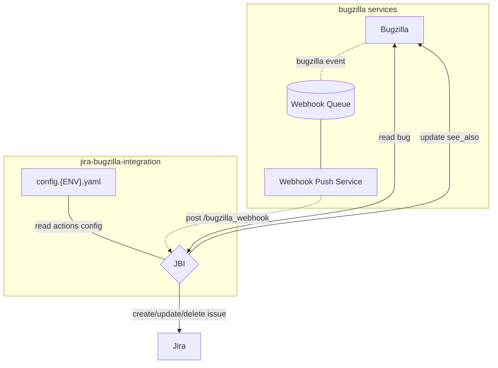

[](https://github.com/mozilla/jira-bugzilla-integration/actions/workflows/build-publish.yaml)
[](https://github.com/mozilla/jira-bugzilla-integration/actions/workflows/test.yaml)
[](https://github.com/pre-commit/pre-commit)

# Jira Bugzilla Integration (JBI)
System to sync Bugzilla bugs to Jira issues.

## Caveats
- The system accepts webhook events from Bugzilla
- Bugs' `whiteboard` tags are used to determine if they should be synchronized or ignored
- The events are transformed into Jira issues
- The system sets the `see_also` field of the Bugzilla bug with the URL to the Jira issue

## Action Configuration
The system reads the actions configuration from a YAML file, one per environment. Each entry controls the synchronization between Bugzilla tickets and the Jira issues.


Below is a full example of an action configuration:
```yaml
- whiteboard_tag: example
  allow_private: false
  contact: example@allizom.com
  description: example configuration
  module: jbi.actions.default
  parameters:
    jira_project_key: EXMPL
```

A bit more about the different fields...
- `whiteboard_tag`
    - string
    - The tag to be matched in the Bugzilla `whiteboard` field
- `allow_private` (optional)
    - bool [true, false]
    - default: false
    - If `false`, bugs will not be synchronized if they are not made public. Note that in order to synchronize private bugs,
     the bugzilla user that JBI runs as must be in the security groups that are making the bug private.
- `contact`
    - an email address, a list of email addresses, or a literal "tbd" to signify that no contact is available
    - If an issue arises with the workflow, communication will be established with these contacts
    - Please enter the contact information for one or more stakeholders
- `description`
    - string
    - Please enter a description; for example, team name or project use-case.
- `enabled` (optional)
    - bool [true, false]
    - default: true
    - If false, matching events will not be synchronized
- `module` (optional)
    - string
    - default: [jbi.actions.default](jbi/actions/default.py)
    - The specified Python module must be available in the `PYTHONPATH`
- `parameters` (optional)
    - dict
    - default: {}
    - The parameters will be validated to ensure the selected action accepts the specified values


[View 'nonprod'  configurations here.](config/config.nonprod.yaml)

[View 'prod' configurations here.](config/config.prod.yaml)


## Available Actions

### Default
The `jbi.actions.default` action will take the list of steps to be executed when
the Webhook is received from configuration.
When none is specified, it will create or update the Jira issue, publish comments when
assignee, status, or resolution are changed, or when a comment is posted on the Bugzilla ticket.

It will also set the Jira issue URL in the Bugzilla bug `see_also` field, and add a link
to the Bugzilla ticket on the Jira issue.

**Parameters**

- `jira_project_key` (**mandatory**)
    - string
    - The Jira project identifier
- `steps` (optional)
    - mapping [str, list[str]]
    - If defined, the specified steps are executed. The group of steps listed under `new` are executed when a Bugzilla event occurs on a ticket that is unknown to Jira. The steps under `existing`, when the Bugzilla ticket is already linked to a Jira issue. The steps under `comment` when a comment is posted on a linked Bugzilla ticket.
    If one of these groups is not specified, the default steps will be used.
- `jira_components` (optional)
   - list [str]
   - If defined, the created issues will be assigned the specified components.
- `sync_whiteboard_labels` (optional)
    - boolean
    - Whether to sync the Bugzilla status whiteboard labels to Jira. Defaults to `true`.
- `status_map` (optional)
    - mapping [str, str]
    - If defined, map the Bugzilla bug status (or resolution) to Jira issue status
- `resolution_map` (optional)
    - mapping [str, str]
    - If defined, map the Bugzilla bug resolution to Jira issue resolution

Minimal configuration:
```yaml
    whiteboard_tag: example
    contact: example@allizom.com
    description: minimal configuration
    parameters:
      jira_project_key: EXMPL
```

Full configuration, that will set assignee, change the Jira issue status and resolution.

```yaml
- whiteboard_tag: fidefe
  contact: example@allizom.com
  description: full configuration
  module: jbi.actions.default
  parameters:
    jira_project_key: FIDEFE
    steps:
      new:
      - create_issue
      - maybe_delete_duplicate
      - add_link_to_bugzilla
      - add_link_to_jira
      - maybe_assign_jira_user
      - maybe_update_issue_resolution
      - maybe_update_issue_status
      existing:
      - update_issue
      - add_jira_comments_for_changes
      - maybe_assign_jira_user
      - maybe_update_issue_resolution
      - maybe_update_issue_status
      comment:
      - create_comment
    status_map:
      ASSIGNED: In Progress
      FIXED: Closed
      WONTFIX: Closed
      DUPLICATE: Closed
      INVALID: Closed
      INCOMPLETE: Closed
      WORKSFORME: Closed
      REOPENED: In Progress
    resolution_map:
      FIXED: Done
      DUPLICATE: Duplicate
      WONTFIX: "Won't Do"
```

In this case if the bug changes to the NEW status the action will attempt to set the linked Jira
issue status to "In Progress". If the bug changes to RESOLVED FIXED it will attempt to set the
linked Jira issue status to "Closed". If the bug changes to a status not listed in `status_map` then
no change will be made to the Jira issue.

### Available Steps

- `create_issue`
- `maybe_delete_duplicate`
- `add_link_to_bugzilla`
- `add_link_to_jira`
- `maybe_assign_jira_user`:
  It will attempt to assign the Jira issue the same person as the bug is assigned to. This relies on
  the user using the same email address in both Bugzilla and Jira. If the user does not exist in Jira
  then the assignee is cleared from the Jira issue. The Jira account that JBI uses requires the "Browse
  users and groups" global permission in order to set the assignee.
- `maybe_update_issue_resolution`:
  If the Bugzilla ticket resolution field is specified in the `resolution_map` parameter, it will set the
  Jira issue resolution.
- `maybe_update_issue_status`:
  If the Bugzilla ticket status field is specified in the `status_map` parameter, it will set the
  Jira issue status.
- `update_issue`
- `add_jira_comments_for_changes`
- `maybe_assign_jira_user`
- `maybe_update_issue_resolution`
- `maybe_update_issue_status`
- `create_comment`

### Custom Actions

If you're looking for a unique capability for your team's data flow, you can add your own Python methods and functionality[...read more here.](jbi/actions/README.md)

## Diagram Overview



## Development

- `make start`: run the application locally (http://localhost:8000)
- `make test`: run the unit tests suites
- `make lint`: static analysis of the code base

You may consider:

* Tweaking the application settings in the `.env` file (See `src/app/environment.py` for details)
* Installing a pre-commit hook to lint your changes with `pre-commit install`

## Deployment

Software and configuration are deployed automatically:

- on NONPROD when a pull-request is merged
- on PROD when a tag is pushed

| Env     | Base URL                                       |
|---------|------------------------------------------------|
| Nonprod | https://stage.jbi.nonprod.cloudops.mozgcp.net/ |
| Prod    | https://jbi.services.mozilla.com/              |

In order to view the configured Jira and Bugzilla, check the root URL:

```
GET /

{
    "configuration": {
        "bugzilla_base_url": "https://bugzilla-dev.allizom.org",
        "jira_base_url": "https://mozit-test.atlassian.net/"
    },
    "description": "JBI v2 Platform",
    "documentation": "/docs",
    "title": "Jira Bugzilla Integration (JBI)",
    "version": "X.Y.Z"
}
```

In order to verify that a certain commit was deployed, check that the Github Actions executed successfully on the commit, and use the *Version* endpoint:

```
GET /__version__

{
  "commit": "1ea792a733d704e0094fe6065ee64b2a3435f280",
  "version": "refs/tags/vX.Y.Z",
  "source": "https://github.com/mozilla/jira-bugzilla-integration",
  "build": "https://github.com/mozilla/jira-bugzilla-integration/actions/runs/2315380477"
}
```

In order to verify that a certain action is configured correctly and enabled, use the *Powered By JBI* endpoint: [https://${SERVER}/powered_by_jbi](https://jbi.services.mozilla.com/powered_by_jbi)

For the list of configured whiteboard tags:

```
GET /whiteboard_tags/
{
    "addons": {
        "whiteboard_tag": "addons",
        "contact": "example@allizom.com",
        "description": "Addons whiteboard tag for AMO Team",
        "enabled": true,
        "module": "jbi.actions.default",
        "parameters": {
            "jira_project_key": "WEBEXT"
        }
    }
    ...
}
```

## Troubleshooting

### Bugzilla tickets are not showing up as issues on Jira

As a consumer, you can:

- Open https://jbi.services.mozilla.com/powered_by_jbi/ and check that your project is listed and enabled there
- Open https://jbi.services.mozilla.com/__heartbeat__ and make sure everything is `true`

If you have access to the configured Bugzilla account:

- Open https://bugzilla.mozilla.org/userprefs.cgi?tab=webhooks
- Check that Webhook is still **enabled**
- Check that WebHook is setup to be executed for your product
- (*if applies*) Check that account can read the private bugs

### Log Explorer Queries Examples

* All incoming WebHooks:

```
jsonPayload.Type="request.summary"
jsonPayload.Fields.path="/bugzilla_webhook"
```

* All action log entries:

```
jsonPayload.Type!="request.summary" AND
(
   NOT jsonPayload.Fields.operation:*  --Entries without `operation` field
   OR (jsonPayload.Fields.operation!="handle" AND jsonPayload.Fields.operation!="ignore")
)
```

* For bugs whose whiteboard contains a certain string:

```
jsonPayload.Fields.bug.whiteboard=~"flowstate"
```

* For a certain Bug number:

```
jsonPayload.Fields.bug.id=1780798
```

* For a certain Jira project:

```
jsonPayload.Fields.action.parameters.jira_project_key="MR"
```


## Metrics

The following metrics are sent via StatsD:

- `jbi.bugzilla.ignored.count`
- `jbi.bugzilla.processed.count`
- `jbi.action.execution.timer`
- `jbi.jira.methods.*.count`
- `jbi.jira.methods.*.timer`
- `jbi.bugzilla.methods.*.count`
- `jbi.bugzilla.methods.*.timer`
