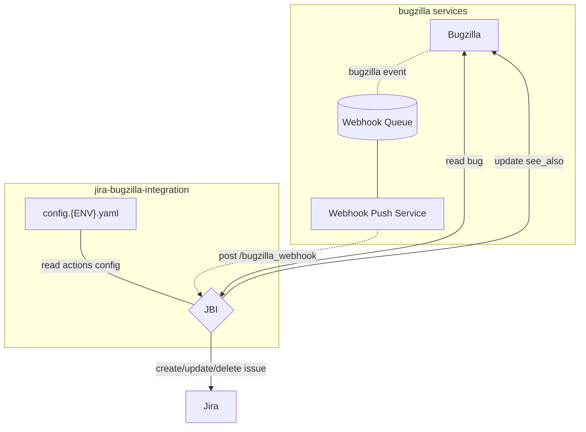

[](https://github.com/mozilla/jira-bugzilla-integration/actions/workflows/build-publish.yaml)
[](https://github.com/mozilla/jira-bugzilla-integration/actions/workflows/test.yaml)
[](https://github.com/pre-commit/pre-commit)

# Jira Bugzilla Integration (JBI)
System to sync Bugzilla bugs to Jira issues.

## Caveats
- The system accepts webhook events from Bugzilla
- Bugs' `whiteboard` tags are used to determine if they should be synchronized or ignored
- The events are transformed into Jira issues
- The system sets the `see_also` field of the Bugzilla bug with the URL to the Jira issue

> **Note:** whiteboard tags are string between brackets, and can have prefixes/suffixes using
> dashes (eg. ``[project]``, ``[project-fx-h2]``, ``[backlog-project]``).

## Diagram Overview



## Documentation

* [Actions](docs/actions.md)
* [Deployment](docs/deployment.md)
* [Troubleshooting](docs/troubleshooting.md)
* [RRA for JBI](https://docs.google.com/document/d/1p0wWVNK5V1jXKAOE-3EquBVcGOIksHD6Rgz9afZQ1A4/edit?usp=sharing)

## Usage

### How to onboard a new project?

1. If you are the admin of the Jira project add the Jira Automation Bot.  Go to Jira project and open 
`Project Settings` then `People`.  Select `Add People` and search for `Jira Automation`.  If two are listed select 
the one with the green logo.  From the `Roles` drop down select `Bots`.  Click `Add 1 person`.
2. If you are not the admin of the Jira project contact the admin to determine how best to request the changes described 
in step 1.
3. Add an entry for your whiteboard tag (eg. `famous-product`) in the [actions configuration files](config/). 
See [actions documentation](docs/actions.md).
4. Open a pull-request with your action configuration changes.  If permissions allow add the label `configuration` to 
the PR.  Indicate in the PR if the Jira Automation Bot has already been added to the Jira project.
5. Once the PR is merged and a release is created, create a bug in bugzilla and add your whiteboard tag to the bug. Note
that the tag must be enclosed in square brackets (eg. `[famous-project]`).  
6. If a Jira item already exists add it to the `See Also` section of the bug to begin syncing.  If a Jira item does not 
already exist one will be created.
7. Verify that the tag is listed in the Labels for the Jira item (eg. `[famous-project]`)

# Development

- `make start`: run the application locally (http://localhost:8000)
- `make test`: run the unit tests suites
- `make lint`: static analysis of the code base
- `make format`: automatically format code to align to linting standards

In order to pass arguments to `pytest`:

```
poetry run pytest -vv -k test_bugzilla_list_webhooks
```

You may consider:

* Tweaking the application settings in the `.env` file (See [jbi/environment.py](../jbi/environment.py) for details)
* Installing a pre-commit hook to lint your changes with `pre-commit install`
