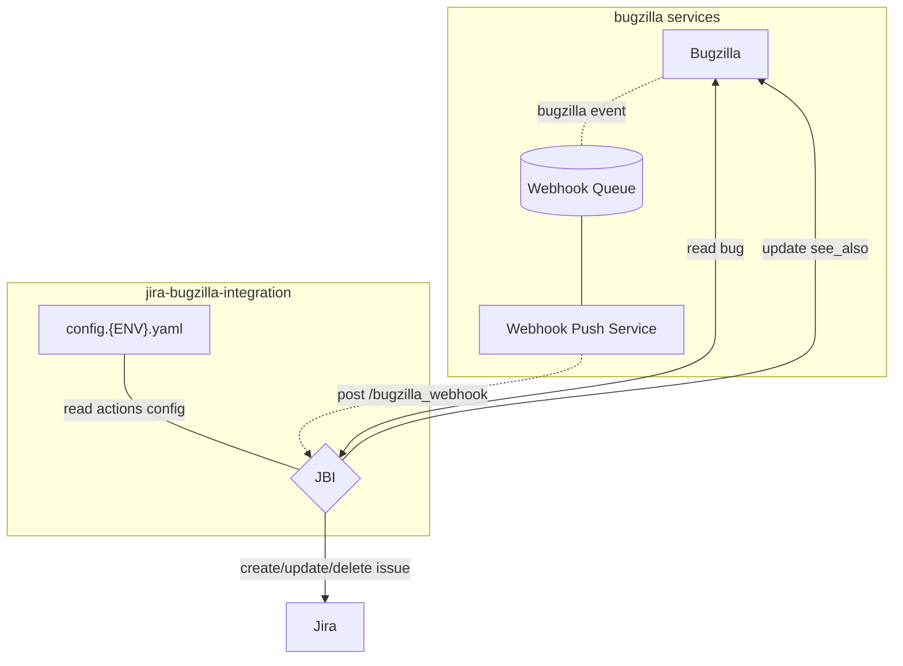

[](https://github.com/mozilla/jira-bugzilla-integration/actions/workflows/build-image.yaml)
[](https://github.com/mozilla/jira-bugzilla-integration/actions/workflows/test-build.yaml)
[](https://github.com/pre-commit/pre-commit)

# Jira Bugzilla Integration (JBI)
System to sync Bugzilla bugs to Jira issues.

### Caveats
- The system accepts webhook events from Bugzilla
- Bugs' whiteboard tags are used to determine if they should be synchronized or ignored
- The events are transformed into Jira issues
- The system sets the `see_also` field of the Bugzilla bug with the URL to the Jira issue

## Action Configuration
The system reads the action configuration from a YAML file, one per environment. Each entry controls the synchronization between Bugzilla tickets with Jira issues.


Below is a full example of an action configuration:
```yaml
    action: src.jbi.whiteboard_actions.default
    allow_private: false
    contact: [example@allizom.com]
    description: example configuration
    enabled: true
    parameters:
      jira_project_key: EXMPL
      whiteboard_tag: example
```

A bit more about the different fields...
- `action` (optional)
    - string
    - default: [src.jbi.whiteboard_actions.default](src/jbi/whiteboard_actions/default.py)
    - The specified Python module must be available in the `PYTHONPATH`
- `allow_private` (optional)
    - bool [true, false]
    - default: false
    - If false bugs that are not public will not be synchronized. Note that in order to synchronize
      private bugs the bugzilla user that JBI runs as must be in the security groups that are making
      the bug private.
- `contact`
    - list of strings
    - If an issue arises with the workflow, communication will be established with these contacts
    - Please enter the contact information for one or more stakeholders
- `description`
    - string
    - Please enter a description; for example, team name or project use-case.
- `enabled` (optional)
    - bool [true, false]
    - default: false
    - If false, matching events will not be synchronized
- `parameters` (optional)
    - dict
    - default: {}
    - The parameters will be validated to ensure the selected action accepts the specified values
    - The [default action](src/jbi/whiteboard_actions/default.py) expects both the `whiteboard_tag` and `jira_project_key` fields


[View 'nonprod'  configurations here.](config/config.nonprod.yaml)

[View 'prod' configurations here.](config/config.prod.yaml)


## Default with assignee and status action
The `src.jbi.whiteboard_actions.default_with_assignee_and_status` action adds some additional
features on top of the default.

It will attempt to assign the Jira issue the same person as the bug is assigned to. This relies on
the user using the same email address in both Bugzilla and Jira. If the user does not exist in Jira
then the assignee is cleared from the Jira issue.

The action supports setting the Jira issues's status when the Bugzilla status and resolution change.
This is defined using a mapping on a per-project basis configured in the `status_map` field of the
`parameters` field.

An example configuration:
```yaml
    action: src.jbi.whiteboard_actions.default_with_assignee_and_status
    contact: [example@allizom.com]
    description: example configuration
    enabled: true
    parameters:
      jira_project_key: EXMPL
      whiteboard_tag: example
      status_map:
        NEW: "In Progress"
        FIXED: "Closed"
```

In this case if the bug changes to the NEW status the action will attempt to set the linked Jira
issue status to "In Progress". If the bug changes to RESOLVED FIXED it will attempt to set the
linked Jira issue status to "Closed". If the bug changes to a status not listed in `status_map` then
no change will be made to the Jira issue.

### Custom Actions
If you're looking for a unique capability for your team's data flow, you can add your own python methods and functionality[...read more here.](src/jbi/whiteboard_actions/README.md)


## Diagram Overview




## Deployment

Software and configuration are deployed automatically:

- on NONPROD when a pull-request is merged
- on PROD when a tag is pushed

| Env     | Base URL                                       |
|---------|------------------------------------------------|
| Nonprod | https://stage.jbi.nonprod.cloudops.mozgcp.net/ |
| Prod    | https://jbi.services.mozilla.com/              |

In order to view the configured Jira and Bugzilla, check the root URL:

```
GET /

{
    "configuration": {
        "bugzilla_base_url": "https://bugzilla-dev.allizom.org",
        "jira_base_url": "https://mozit-test.atlassian.net/"
    },
    "description": "JBI v2 Platform",
    "documentation": "/docs",
    "title": "Jira Bugzilla Integration (JBI)",
    "version": "2.0.1"
}
```

In order to verify that a certain commit was deployed, check that the Github Actions executed successfully on the commit, and use the *Version* endpoint:

```
GET /__version__

{
  "commit": "1ea792a733d704e0094fe6065ee64b2a3435f280",
  "version": "refs/tags/v2.0.1",
  "image_tag": "v2.0.1",
  "source": "https://github.com/mozilla/jira-bugzilla-integration",
  "build": "https://github.com/mozilla/jira-bugzilla-integration/actions/runs/2315380477"
}
```

In order to verify that a certain action is configured correctly and enabled, use the *Powered By JBI* endpoint: [https://${SERVER}/powered_by_jbi](https://jbi.services.mozilla.com/powered_by_jbi)

For the list of configured whiteboard tags:

```
GET /whiteboard_tags/
{
    "addons": {
        "action": "src.jbi.whiteboard_actions.default",
        "contact": "tbd",
        "description": "Addons whiteboard tag for AMO Team",
        "enabled": true,
        "parameters": {
            "jira_project_key": "WEBEXT",
            "whiteboard_tag": "addons"
        }
    },
    ...
}
```
