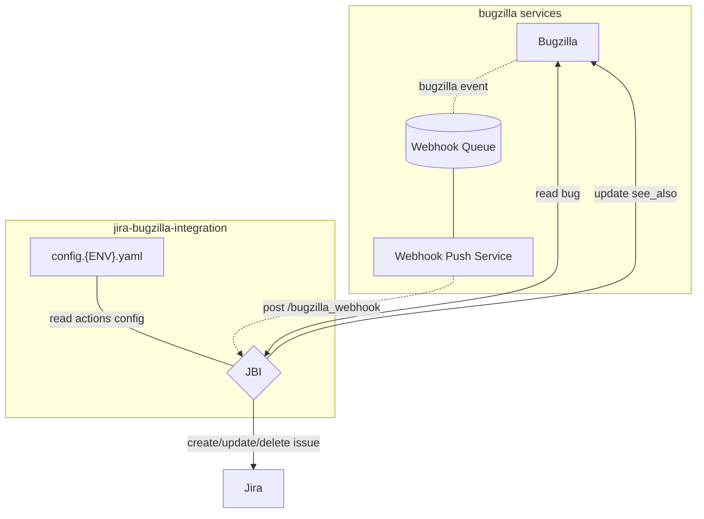

# Jira Bugzilla Integration (JBI)
System to sync Bugzilla bugs to Jira issues.

## Caveats
- The system accepts webhook events from Bugzilla
- Bugs' `whiteboard` tags are used to determine if they should be synchronized or ignored
- The events are transformed into Jira issues
- The system sets the `see_also` field of the Bugzilla bug with the URL to the Jira issue

## Diagram Overview

## Usage

### How to onboard a new project?

1. Add an entry for your whiteboard tag (eg. `famous-product`) in the actions configuration file. See [actions documentation](docs/actions.md))
2. Open a pull-request with your action configuration changes
3. Open a ticket to request the appropriate permissions to be given to the bot account (`Jira Automation`) on the Jira project ([example ticket](https://mozilla-hub.atlassian.net/servicedesk/customer/portal/4/SDD-12038))
