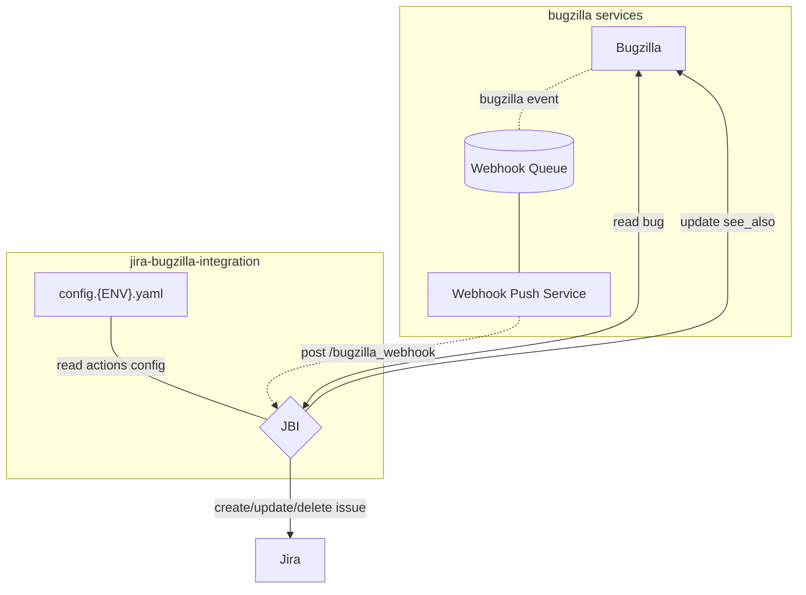

[](https://github.com/mozilla/jira-bugzilla-integration/actions/workflows/build-publish.yaml)
[](https://github.com/mozilla/jira-bugzilla-integration/actions/workflows/test.yaml)
[](https://github.com/pre-commit/pre-commit)

# Jira Bugzilla Integration (JBI)
System to sync Bugzilla bugs to Jira issues.

## Caveats
- The system accepts webhook events from Bugzilla
- Bugs' `whiteboard` tags are used to determine if they should be synchronized or ignored
- The events are transformed into Jira issues
- The system sets the `see_also` field of the Bugzilla bug with the URL to the Jira issue


## Diagram Overview



## Deployment

Software and configuration are deployed automatically:

- on NONPROD when a pull-request is merged
- on PROD when a tag is pushed

| Env     | Base URL                                       |
|---------|------------------------------------------------|
| Nonprod | https://stage.jbi.nonprod.cloudops.mozgcp.net/ |
| Prod    | https://jbi.services.mozilla.com/              |

In order to view the configured Jira and Bugzilla, check the root URL:

```
GET /

{
    "configuration": {
        "bugzilla_base_url": "https://bugzilla-dev.allizom.org",
        "jira_base_url": "https://mozit-test.atlassian.net/"
    },
    "description": "JBI v2 Platform",
    "documentation": "/docs",
    "title": "Jira Bugzilla Integration (JBI)",
    "version": "X.Y.Z"
}
```

In order to verify that a certain commit was deployed, check that the Github Actions executed successfully on the commit, and use the *Version* endpoint:

```
GET /__version__

{
  "commit": "1ea792a733d704e0094fe6065ee64b2a3435f280",
  "version": "refs/tags/vX.Y.Z",
  "source": "https://github.com/mozilla/jira-bugzilla-integration",
  "build": "https://github.com/mozilla/jira-bugzilla-integration/actions/runs/2315380477"
}
```

In order to verify that a certain action is configured correctly and enabled, use the *Powered By JBI* endpoint: [https://${SERVER}/powered_by_jbi](https://jbi.services.mozilla.com/powered_by_jbi)

For the list of configured whiteboard tags:

```
GET /whiteboard_tags/
{
    "addons": {
        "whiteboard_tag": "addons",
        "bugzilla_user_id": 514230,
        "description": "Addons whiteboard tag for AMO Team",
        "enabled": true,
        "module": "jbi.actions.default",
        "parameters": {
            "jira_project_key": "WEBEXT"
        }
    }
    ...
}
```

## Metrics

The following metrics are sent via StatsD:

- `jbi.bugzilla.ignored.count`
- `jbi.bugzilla.processed.count`
- `jbi.action.execution.timer`
- `jbi.jira.methods.*.count`
- `jbi.jira.methods.*.timer`
- `jbi.bugzilla.methods.*.count`
- `jbi.bugzilla.methods.*.timer`
